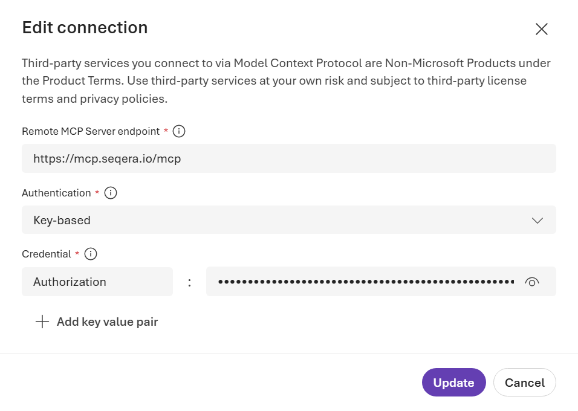

# Building Multi-agentic Bioworkflows with Microsoft Foundry and Nextflow

<h3 align="right">Colby T. Ford, Ph.D.</h3>

Demo from Nextflow Summit 2026 on using Microsoft Foundry to orchestrate Nextflow workloads.

## Abstract

As bioinformatics workflows grow in scale and complexity, automating the data retrieval, analysis, and interpretation is imperative for scalable analyses. What if pipelines could reason about their own execution, adapt to intermediate results, and collaborate with other agents to drive scientific discovery? In this session, we introduce best practices in building multi-agentic workflows for bioinformatics that combine the easy AI agent capabilities provided by the Microsoft Foundry platform with the power of Nextflow. We will demonstrate how to design AI agents that can interpret biological intent, dynamically parameterize and launch Nextflow pipelines, monitor execution state, and post-process results, closing the loop between human hypothesis and computational analysis.

This talk is a bio-themed deep dive into content from “Building Agentic Solutions with Microsoft Foundry” by Colby T. Ford, Ph.D. (O’Reilly Media, 2026) and is intended for bioinformaticians and AI developers who are exploring how agentic systems can augment reproducible computational biology.

## Configuration

### 1. Connect to the Seqera Cloud MCP Server

Create a `SeqeraCloud` tool in Microsoft Foundry and configure it with your Nextflow credentials.

    - Remote MCP server endpoint: `https://mcp.seqera.io/mcp`
    - Authentication: Key-based
    - Credential name: `Authorization`
    - Credential value: `Bearer <your Seqera cloud token>`




### 2. Create an Bioinformatics Evaluator Agent

Create a `bioinformatics-eval-agent` agent in Microsoft Foundry using the [agents/bioinformatics-eval-agent-prompt.md](agents/bioinformatics-eval-agent-prompt.md) prompt. (Look at the [agents/bioinformatics-eval-agent.yaml](agents/bioinformatics-eval-agent.yaml) as a reference.)

This agent evaluates a given user prompt and breaks it down into structured components that can be used by subsequent agents. This include an evaluation of the biological problem, data requirements, workflow steps, etc.


### 3. Create an Agent to Connect to the Seqera Cloud Tool 

Create a `seqera-agent` agent in Microsoft Foundry using the [agents/seqera-agent-prompt.md](agents/seqera-agent-prompt.md) prompt. (Look at the [agents/seqera-agent.yaml](agents/seqera-agent.yaml) file as a reference.)

This agent communicates with the Seqera Cloud MCP server to search for datasets, discover pipelines, and execute workflows based on the structured plan provided by the `bioinformatics-eval-agent`.


## Workflow

```
Help me to design a bioinformatics workflow for SRA bioproject PRJNA784582.
```